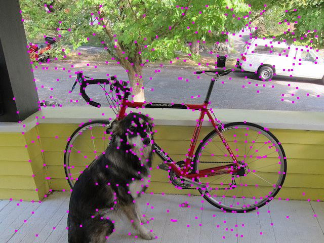

# Superpoint.cpp

This project shows how to implement Superpoint point extraction and description with ggml using pretrained model weights.

The feature is no thirdparty dependencies needed~

If you want to integrate superpoint to your project and refuse to use thirdparty libs like libtorch, tensorrt, etc, superpoint.cpp is an option!

TODO:

* image has to been preprocessed to size of 480,640
* image loading is complex and dirty
* acceleration ...

Download the model weights:(optional)

```bash
$ wget https://github.com/magicleap/SuperPointPretrainedNetwork/blob/master/superpoint_v1.pth

```

compile the project and generate the executable file

```bash
$ mkdir build
$ cd build
$ cmake ..
$ make
$ mv bin/superpoint ../examples/superpoint

```

Convert the weights to GGUF format (optional): since the superpoint.gguf is uploaded to the folder superpoint, this step could be skipped.

```bash
$ cd /examples/superpoint
$ ./convert-pth-ggml.py
```

inference

```bash
$ ./superpoint -i dog_color.jpg
```

# Result

feature extration



matching performance


# Reference

https://github.com/ggerganov/ggml

https://github.com/magicleap/SuperPointPretrainedNetwork


https://github.com/adityamwagh/SuperSLAM
